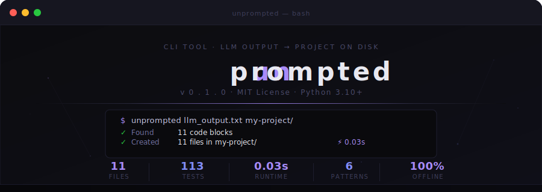

<div align="center">

<br/>

```
██╗   ██╗███╗   ██╗██████╗ ██████╗  ██████╗ ███╗   ███╗██████╗ ████████╗███████╗██████╗
██║   ██║████╗  ██║██╔══██╗██╔══██╗██╔═══██╗████╗ ████║██╔══██╗╚══██╔══╝██╔════╝██╔══██╗
██║   ██║██╔██╗ ██║██████╔╝██████╔╝██║   ██║██╔████╔██║██████╔╝   ██║   █████╗  ██║  ██║
██║   ██║██║╚██╗██║██╔═══╝ ██╔══██╗██║   ██║██║╚██╔╝██║██╔═══╝    ██║   ██╔══╝  ██║  ██║
╚██████╔╝██║ ╚████║██║     ██║  ██║╚██████╔╝██║ ╚═╝ ██║██║        ██║   ███████╗██████╔╝
 ╚═════╝ ╚═╝  ╚═══╝╚═╝     ╚═╝  ╚═╝ ╚═════╝ ╚═╝     ╚═╝╚═╝        ╚═╝   ╚══════╝╚═════╝
```

### *Stop copy-pasting. Start shipping.*

**Convert raw LLM output into fully structured, ready-to-run projects — in one command.**

<br/>

[](https://pypi.org/project/unprompted/)
[](https://pypi.org/project/unprompted/)
[](https://opensource.org/licenses/MIT)
[](https://github.com/githubusername/unprompted/actions)
[](https://github.com/astral-sh/ruff)
[](https://github.com/astral-sh/uv)

<br/>

[**Why unprompted?**](#-the-problem) · [**Install**](#-install) · [**Usage**](#-usage) · [**How It Works**](#-how-it-works) · [**Contributing**](#-contributing)

<br/>

</div>

---

## 🧩 The Problem

You ask an LLM to scaffold a project. It generates something like this:

```
### app.py
```python
from flask import Flask
app = Flask(__name__)
```

### requirements.txt
```txt
flask>=3.0.0
```

### Dockerfile
```dockerfile
FROM python:3.12-slim
...
```
```

Now you have to:

- 📁 Manually create every folder
- 📄 Manually create every file
- 🖱️ Copy-paste each block one by one
- 🔧 Fix the whitespace and indentation
- 😮‍💨 Repeat this for every single project

For a 10-file project — that's **10 minutes of mindless, error-prone busywork. Every. Single. Time.**

---

## ✅ The Solution

```bash
unprompted llm_output.txt my-project/
```

**One command. Full project on disk. Zero copy-pasting.**

```
╭──────────────────────────────────────────╮
│  unprompted v0.1.0                       │
│  LLM output → structured project         │
╰──────────────────────────────────────────╯

✓  Scanned   llm_output.txt
✓  Found     11 code block(s)
✓  Resolved  11 file(s)

Project structure preview:

  my-project/
  ├── .env.example
  ├── Dockerfile
  ├── app.py
  ├── config.py
  ├── models.py
  ├── requirements.txt
  ├── api/
  │   └── routes.py
  ├── scripts/
  │   └── start.sh
  ├── static/
  │   ├── app.js
  │   └── style.css
  └── templates/
      └── index.html

✓  Created 11 file(s) in my-project/

  Done in 0.03s ⚡
```

---

## 📦 Install

### Requirements

- Python **3.10+**

### Choose your install method

**pipx** — recommended for CLI tools, fully isolated

```bash
pipx install unprompted
```

**pip** — classic

```bash
pip install unprompted
```

**uvx** — no install needed, just run

```bash
uvx unprompted input.txt output/
```

**From source** — for contributors

```bash
git clone https://github.com/githubusername/unprompted
cd unprompted
uv sync
uv run unprompted --help
```

---

## 📖 Usage

### The basics

```bash
unprompted INPUT_FILE OUTPUT_DIR [OPTIONS]
```

### Always preview first

```bash
unprompted input.txt my-project/ --dry-run
```

This shows exactly what will be created — without touching your filesystem.

### All options

| Flag | Short | Description |
|------|-------|-------------|
| `--dry-run` | | Preview files without writing anything |
| `--force` | `-f` | Overwrite files that already exist |
| `--zip` | `-z` | Bundle output as `project.zip` instead of a folder |
| `--verbose` | `-v` | Show detailed debug logs |
| `--version` | `-V` | Print version and exit |
| `--help` | `-h` | Show help and exit |

### Real-world examples

```bash
# Safe preview — see what would be created
unprompted output.txt my-project/ --dry-run

# Write the project
unprompted output.txt my-project/

# Overwrite an existing folder
unprompted output.txt my-project/ --force

# Get a zip instead of a folder (great for sharing)
unprompted output.txt my-project/ --zip

# Debug a tricky LLM output
unprompted output.txt my-project/ --verbose --dry-run

# Full power mode
unprompted output.txt my-project/ --force --zip --verbose
```

---

## 🧠 How It Works

unprompted runs a deterministic **3-stage pipeline** — no AI involved, no network calls, no magic:

```
input.txt
    │
    ▼
┌─────────────────────────────────────────────────────────┐
│  Stage 1 · Parser                                       │
│                                                         │
│  · Reads file line by line                              │
│  · Extracts all triple-backtick code blocks             │
│  · Captures surrounding context per block               │
│  · Flags and discards tree diagrams + shell examples    │
└───────────────────────┬─────────────────────────────────┘
                        │  List[RawBlock]
                        ▼
┌─────────────────────────────────────────────────────────┐
│  Stage 2 · Extractor                                    │
│                                                         │
│  · Scans context lines for filename signals             │
│  · Maps each block → FileObject (path + content)        │
│  · Infers extensions from language hints                │
│  · Deduplicates conflicting filenames                   │
│  · Auto-names any blocks with undetected filenames      │
└───────────────────────┬─────────────────────────────────┘
                        │  List[FileObject]
                        ▼
┌─────────────────────────────────────────────────────────┐
│  Stage 3 · Builder                                      │
│                                                         │
│  · Creates parent directories with os.makedirs()        │
│  · Writes files preserving exact content + indentation  │
│  · Respects --dry-run / --force / --zip flags           │
│  · Prints Rich-formatted summary to terminal            │
└───────────────────────┬─────────────────────────────────┘
                        │
                        ▼
                   output/
                   ├── app.py
                   ├── config.py
                   └── ...
```

---

## 🔍 Filename Detection

unprompted detects filenames from **6 different patterns** — handling everything real LLMs actually output:

| Pattern | Raw LLM output | Detected path |
|---------|---------------|---------------|
| Markdown heading | `### src/app.py` | `src/app.py` |
| Explicit label | `File: config.py` | `config.py` |
| Backtick-wrapped | `` `api/routes.py` `` | `api/routes.py` |
| Bold-wrapped | `**models.py**` | `models.py` |
| Bare path | `static/style.css` | `static/style.css` |
| Known special file | `Dockerfile` / `Makefile` | `Dockerfile` |

### Edge Cases — Fully Handled

| Situation | What unprompted does |
|-----------|---------------------|
| No filename found | Auto-generates `file_1.py`, `file_2.js`, etc. |
| Duplicate filenames | Appends suffix → `app.py`, `app_1.py` |
| Nested paths | Creates all parent directories automatically |
| Missing extension | Infers from language hint (` ```python ` → `.py`) |
| Directory tree blocks | Detected automatically and discarded |
| Shell command examples | Detected automatically and discarded |
| Unclosed code fence | Content saved with a warning |

---

## 🗂️ Project Structure

```
unprompted/
├── src/
│   └── unprompted/
│       ├── __init__.py        # Version info
│       ├── main.py            # CLI entry point (Click)
│       ├── models.py          # Data structures — RawBlock, FileObject
│       ├── parser.py          # Stage 1 — extract code blocks from text
│       ├── extractor.py       # Stage 2 — map blocks → file paths
│       ├── builder.py         # Stage 3 — write to disk or zip
│       └── utils.py           # Pure helper functions
├── tests/
│   ├── test_utils.py          # 47 tests
│   ├── test_parser.py         # 15 tests
│   ├── test_extractor.py      # 24 tests
│   └── test_builder.py        # 17 tests
├── sample_input.txt           # Real LLM output for manual testing
├── pyproject.toml             # Project config + dependencies
├── LICENSE
└── README.md
```

---

## 🔧 Development

### Setup

```bash
git clone https://github.com/githubusername/unprompted
cd unprompted
uv sync --group dev
```

### Run locally

```bash
uv run unprompted sample_input.txt output/ --dry-run
```

### Tests

```bash
# Run all 113 tests
uv run pytest --verbose

# Run a specific module
uv run pytest tests/test_parser.py -v

# With coverage report
uv run pytest --cov=src/unprompted --cov-report=term-missing
```

### Lint & type-check

```bash
# Lint
uv run ruff check src/

# Auto-fix lint issues
uv run ruff check src/ --fix

# Type check
uv run mypy src/
```

### Run everything at once

```bash
uv run ruff check src/ --fix && uv run mypy src/ && uv run pytest
```

---

## 🤝 Contributing

Contributions are very welcome. Whether it's a bug fix, a new filename pattern, or better docs — PRs are appreciated.

### How to contribute

```bash
# 1. Fork on GitHub, then clone
git clone https://github.com/YOUR_USERNAME/unprompted
cd unprompted

# 2. Create a branch
git checkout -b fix/your-bug-name
# or
git checkout -b feat/your-feature-name

# 3. Make your changes

# 4. Run checks
uv run ruff check src/ --fix
uv run mypy src/
uv run pytest

# 5. Commit and push
git add .
git commit -m "fix: describe what you changed"
git push origin fix/your-bug-name

# 6. Open a Pull Request
```

### Good first issues

- Add support for a new filename pattern you've seen in LLM output
- Improve auto-naming logic for undetected blocks
- Add more test cases for edge cases in `test_parser.py`
- Improve the `--verbose` output for easier debugging

### Reporting bugs

Please include:

- The **exact command** you ran
- A **minimal input file** that reproduces the bug
- **Actual output** vs **expected output**
- Your **OS** and **Python version** (`python --version`)

---

## 🗺️ Roadmap

> These are ideas being considered — not promises.

| Feature | Status |
|---------|--------|
| Core pipeline (parse → extract → build) | ✅ Done |
| `--dry-run`, `--force`, `--zip` flags | ✅ Done |
| 113 unit tests across all modules | ✅ Done |
| Clipboard support (`unprompted --clip`) | 🔜 Planned |
| Pipe from stdin (`cat output.txt \| unprompted`) | 🔜 Planned |
| Interactive conflict resolution mode | 🔜 Planned |
| Plugin system for custom filename resolvers | 💡 Exploring |
| VSCode extension | 💡 Exploring |

---

## ❓ FAQ

**Does this use AI or make network calls?**

No. unprompted is a pure local CLI tool. It parses text using deterministic pattern matching — no AI, no API calls, no telemetry. It works completely offline.

**What LLMs does it work with?**

Any of them. unprompted just reads text files — it doesn't care where the output came from. Works with Claude, ChatGPT, Gemini, Mistral, local models via Ollama, or anything else.

**What if the LLM formats its output differently?**

unprompted detects filenames from 6 different patterns and handles the most common formatting styles. If you find a real-world format it misses, open an issue with a sample — new patterns are easy to add.

**Does it preserve exact indentation and whitespace?**

Yes. File content is written exactly as it appears inside the code block — no reformatting, no changes.

**Can it handle nested folders?**

Yes. If the LLM outputs `src/api/routes.py`, unprompted will create `src/`, `src/api/`, and `routes.py` automatically.

**What if a filename appears twice?**

It deduplicates: the first occurrence becomes `app.py`, the second becomes `app_1.py`, and so on.

---

## 🔒 Security

If you discover a security vulnerability, please **do not open a public issue.**

Email directly: **prakashkuvvam@gmail.com**

Please include a description, steps to reproduce, and potential impact. You'll receive a response within 48 hours.

---

## 📄 License


```
MIT License — Copyright (c) 2026 Kuvam Sai Prakash

Permission is hereby granted, free of charge, to any person obtaining a copy
of this software and associated documentation files (the "Software"), to deal
in the Software without restriction, including without limitation the rights
to use, copy, modify, merge, publish, distribute, sublicense, and/or sell
copies of the Software, and to permit persons to whom the Software is
furnished to do so, subject to the following conditions:

The above copyright notice and this permission notice shall be included in all
copies or substantial portions of the Software.

THE SOFTWARE IS PROVIDED "AS IS", WITHOUT WARRANTY OF ANY KIND, EXPRESS OR
IMPLIED, INCLUDING BUT NOT LIMITED TO THE WARRANTIES OF MERCHANTABILITY,
FITNESS FOR A PARTICULAR PURPOSE AND NONINFRINGEMENT.
```

---

## 👤 Author

<div align="center">

<br/>

**Kuvam Sai Prakash** · *Developer · Automation Builder · LLM Tooling Enthusiast*

[](https://github.com/Prakashkuvvam)
[](https://linkedin.com/in/prakashkuvvam)
[](mailto:prakashkuvvam@gmail.com)

<br/>

*Built out of frustration. Polished out of love for the craft.*

<br/>

</div>

---

<div align="center">

<br/>

<picture>
  <source media="(prefers-color-scheme: dark)" srcset="assets/banner.svg">
  
</picture>

<!--
  ╔══════════════════════════════════════════════════════╗
  ║            u n p r o m p t e d  ·  v0.1.0           ║
  ║        stop copy-pasting. start shipping.            ║
  ║                                                      ║
  ║   $ unprompted llm_output.txt my-project/            ║
  ║     ✓ Found    11 code blocks                        ║
  ║     ✓ Resolved 11 files                              ║
  ║     ✓ Created  11 files in my-project/  ⚡ 0.03s     ║
  ║                                                      ║
  ║   11 files · 113 tests · 0.03s · 6 patterns          ║
  ╚══════════════════════════════════════════════════════╝
-->

<br/>

**unprompted** · MIT License · © 2026 Kuvam Sai Prakash

*For every developer who ever spent 10 minutes manually recreating what an LLM just wrote.*

<br/>

[](https://github.com/prakashkuvvam/unprompted)

<br/>

</div>
